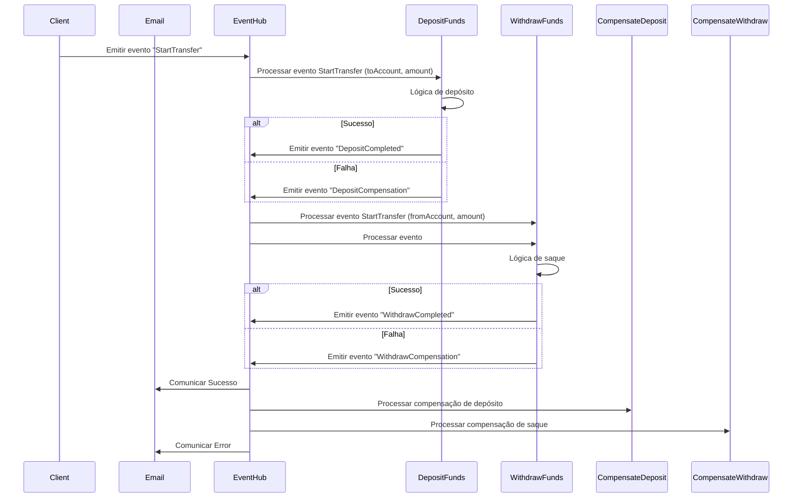

# Creating a Choreographed Architecture Using the Sagas Pattern with Azure Functions

In this tutorial, I will show you how I created a choreographed architecture based on the Sagas pattern using Azure Functions. The application I built is a financial transfer service that includes deposit and withdrawal operations, as well as their compensations in case of failure.

## Overview

### What is the Sagas Pattern?
The Sagas pattern is an approach to managing distributed transactions. It divides a long transaction into a series of smaller transactions, each with a corresponding compensation operation. If a transaction fails, the compensating operations are executed to revert the changes made by the previous transactions.

### Choreographed Architecture
In choreography, each service or function executes its logic and publishes events that trigger other functions, without a central orchestrator. This allows for a more flexible and resilient system.

## Prerequisites

- Azure account
- Node.js and npm installed
- Visual Studio Code
- Azure Functions Core Tools

## Project Structure

The project structure is as follows:

```plaintext
.vscode/
  extensions.json
  launch.json
  settings.json
  tasks.json
ClientFunction/
  function.json
  index.ts
CompensateDeposit/
  function.json
  index.ts
CompensateWithdraw/
  function.json
  index.ts
DepositFunds/
  function.json
  index.ts
WithdrawFunds/
  function.json
  index.ts
types/
  index.d.ts
.gitignore
host.json
package-lock.json
package.json
tsconfig.json
```

## Step-by-Step

### 1. Setting Up the Project

First, I created a new Azure Functions project using the command:

```bash
func init sagas-coreograph --typescript
```

Then, I installed the necessary dependencies:

```bash
npm install @azure/functions @azure/event-hubs
```

### 2. Implementing the Functions

#### Transaction Initializer Function

I created the `ClientFunction` to initiate the transaction:

```typescript
// ClientFunction/index.ts
import { EventData, EventHubProducerClient } from "@azure/event-hubs";
import { AzureFunction, Context, HttpRequest } from "@azure/functions"

const connectionString = process.env.AZURE_EVENTHUB_CONNECTIONSTRING;
const eventHubname = process.env.AZURE_EVENTHUB_NAME;

const producerClient = new EventHubProducerClient(connectionString, eventHubname);

const httpTrigger: AzureFunction = async function (context: Context, req: HttpRequest): Promise<void> {
    const { fromAccount, toAccount, amount } = req.body;

    if (!fromAccount || !toAccount || !amount) {
        context.log.error("ClientFunction: Missing required properties in message:", req.body);
        context.res = {
            status: 400,
            body: "Missing required properties in the request.",
        };
        return;
    }

    const event: EventData = {
        body: { type: "StartTransfer", fromAccount, toAccount, amount },
    };

    try {
        await producerClient.sendBatch([event]);
        context.res = {
            status: 202,
            body: "Transaction initiated.",
        };
    } catch (error) {
        context.log.error("Failed to send event to Event Hub:", error);
        context.res = {
            status: 500,
            body: "Error initiating transaction.",
        };
    }
};

export default httpTrigger;
```

#### Deposit Function

I created the `DepositFunds` function that processes the deposit:

```typescript
// DepositFunds/index.ts
import { EventData, EventHubProducerClient } from "@azure/event-hubs";
import { AzureFunction, Context } from "@azure/functions";

const connectionString = process.env.AZURE_EVENTHUB_CONNECTIONSTRING;
const eventHubname = process.env.AZURE_EVENTHUB_NAME;

const eventHubTrigger: AzureFunction = async function (context: Context, eventHubMessages: any[]): Promise<void> {
    const producerClient = new EventHubProducerClient(connectionString, eventHubname);
    
    try {
        for (const message of eventHubMessages) {
            if (!message) {
                context.log.error("DepositFunds: Invalid or undefined message body:", message);
                continue;
            }

            let parsedMessage;
            try {
                parsedMessage = JSON.parse(message);
            } catch (err) {
                context.log.error("DepositFunds: Error parsing message:", err);
                continue;
            }

            const { toAccount, amount, type } = parsedMessage;

            if(type !== "StartTransfer") {
                continue;
            }

            if (!toAccount || !amount) {
                context.log.error("DepositFunds: Missing required properties in message:", parsedMessage);
                continue;
            }

            context.log(`DepositFunds: Initiating deposit of ${amount} to ${toAccount}`);

            const success = Math.random() > 0.2;

            try {
                if (success) {
                    const event: EventData = {
                        body:{ type: "DepositCompleted", toAccount, amount }
                    };
                    await producerClient.sendBatch([event]);
                    context.log("DepositFunds: Deposit succeeded.");
                } else {
                    const event: EventData = {
                        body:{ type: "DepositCompensation", toAccount, amount }
                    };
                    await producerClient.sendBatch([event]);
                    context.log.error("DepositFunds: Deposit failed. Compensation event emitted.");
                }
            } catch (eventError) {
                context.log.error(`DepositFunds: Error sending event for account ${toAccount}:`, eventError);
            }
        }
    } catch (error) {
        context.log.error("DepositFunds: Error processing messages:", error);
    } finally {
        await producerClient.close();
    }
};

export default eventHubTrigger;
```

#### Withdrawal Function

I created the `WithdrawFunds` function that processes the withdrawal:

```typescript
// WithdrawFunds/index.ts
import { EventData, EventHubProducerClient } from "@azure/event-hubs";
import { AzureFunction, Context } from "@azure/functions";

const connectionString = process.env.AZURE_EVENTHUB_CONNECTIONSTRING;
const eventHubname = process.env.AZURE_EVENTHUB_NAME;

const eventHubTrigger: AzureFunction = async function (context: Context, eventHubMessages: any[]): Promise<void> {
    const producerClient = new EventHubProducerClient(connectionString, eventHubname);
    
    try {
        for (const message of eventHubMessages) {
            if (!message) {
                context.log.error("WithdrawFunds: Invalid or undefined message body:", message);
                continue;
            }

            let parsedMessage;
            try {
                parsedMessage = JSON.parse(message);
            } catch (err) {
                context.log.error("WithdrawFunds: Error parsing message:", err);
                continue;
            }

            const { fromAccount, amount, type } = parsedMessage;

            if(type !== "StartTransfer") {
                continue;
            }

            if (!fromAccount || !amount) {
                context.log.error("WithdrawFunds: Missing required properties in message:", message);
                return;
            }

            context.log(`WithdrawFunds: Initiating withdrawal of ${amount} from ${fromAccount}`);

            const success = Math.random() > 0.2;

            try {
                if (success) {
                    const event: EventData = {
                        body:{ type: "WithdrawCompleted", fromAccount, amount }
                    };
                    await producerClient.sendBatch([event]);
                    context.log("WithdrawFunds: Withdrawal succeeded.");
                } else {
                    const event: EventData = {
                        body:{ type: "WithdrawCompensation", fromAccount, amount }
                    };
                    await producerClient.sendBatch([event]);
                    context.log.error("WithdrawFunds: Withdrawal failed. Compensation event emitted.");
                }
            } catch (eventError) {
                context.log.error(`WithdrawFunds: Error sending event for account ${fromAccount}:`, eventError);
            }
        }
    } catch (error) {
        context.log.error("WithdrawFunds: Error processing messages:", error);
    } finally {
        await producerClient.close();
    }
};

export default eventHubTrigger;
```

#### Compensation Functions

I created the `CompensateDeposit` function to revert the deposit:

```typescript
// CompensateDeposit/index.ts
import { AzureFunction, Context } from "@azure/functions";

const eventHubTrigger: AzureFunction = async function (context: Context, eventHubMessages: any[]): Promise<void> {
    try {
        for (const message of eventHubMessages) {
            if (!message) {
                context.log.error("CompensateDeposit: Invalid or undefined message body:", message);
                continue;
            }

            let parsedMessage;
            try {
                parsedMessage = JSON.parse(message);
            } catch (err) {
                context.log.error("CompensateDeposit: Error parsing message:", err);
                continue;
            }

            const { toAccount, amount, type } = parsedMessage;

            if(type !== "DepositCompensation") {
                continue;
            }

            if (!toAccount || !amount) {
                context.log.error("CompensateDeposit: Missing required properties in message:", parsedMessage);
                continue;
            }

            context.log(`CompensateDeposit: Reverting deposit of ${amount} from ${toAccount}`);
        }
    } catch (error) {
        context.log.error("CompensateDeposit: Error processing messages:", error);
    }
};

export default eventHubTrigger;
```

I created the `CompensateWithdraw` function to revert the withdrawal:

```typescript
// CompensateWithdraw/index.ts
import { AzureFunction, Context } from "@azure/functions";

const eventHubTrigger: AzureFunction = async function (context: Context, eventHubMessages: any[]): Promise<void> {
    try {
        for (const message of eventHubMessages) {
            if (!message) {
                context.log.error("CompensateWithdraw: Invalid or undefined message body:", message);
                continue;
            }

            let parsedMessage;
            try {
                parsedMessage = JSON.parse(message);
            } catch (err) {
                context.log.error("CompensateWithdraw: Error parsing message:", err);
                continue;
            }

            const { toAccount, amount, type } = parsedMessage;

            if(type !== "WithdrawCompensation") {
                continue;
            }

            if (!toAccount || !amount) {
                context.log.error("CompensateWithdraw: Missing required properties in message:", parsedMessage);
                continue;
            }

            context.log(`CompensateWithdraw: Reverting deposit of ${amount} from ${toAccount}`);
        }
    } catch (error) {
        context.log.error("CompensateWithdraw: Error processing messages:", error);
    }
};

export default eventHubTrigger;
```

### 3. Configuring Azure Functions

I configured the environment variables in the `local.settings.json` file:

```json
{
  "IsEncrypted": false,
  "Values": {
    "AzureWebJobsStorage": "UseDevelopmentStorage=true",
    "FUNCTIONS_WORKER_RUNTIME": "node",
    "AZURE_EVENTHUB_CONNECTIONSTRING": "<Your Event Hub Connection String>",
    "AZURE_EVENTHUB_NAME": "<Your Event Hub Name>"
  }
}
```

### 4. Testing the Project

To test the project, I started Azure Functions locally:

```bash
func start
```

I sent an HTTP request to the `ClientFunction` to initiate the transaction:

```bash
curl -X POST http://localhost:7071/api/ClientFunction -H "Content-Type: application/json" -d '{
  "fromAccount": "12345",
  "toAccount": "67890",
  "amount": 100
}'
```

I checked the logs to observe the processing of the messages and the execution of the compensation functions in case of failure.

### Sequence Diagram

Here is the sequence diagram representing the flow:



## Conclusion

In this tutorial, I created a choreographed architecture based on the Sagas pattern using Azure Functions. I implemented functions to initiate transactions, process deposits and withdrawals, and perform compensation operations in case of failures. This approach allows for managing distributed transactions in a resilient and scalable manner.

Now, you can expand this architecture to include other financial operations and add tests to ensure the robustness of the system.